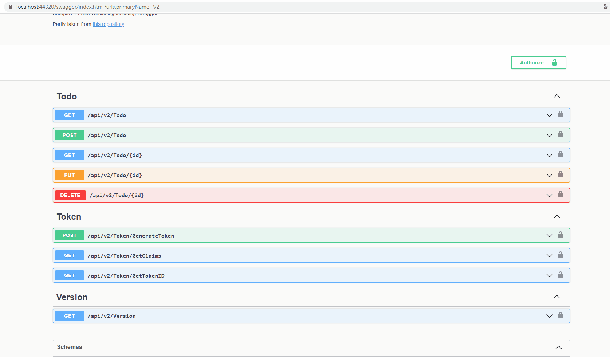

# ASP.NET-Core-RESTfulAPI-JWT 
示範在.net core API中建置JWT Token機制。

### API規格

<table>
<tbody><tr><th>方法</th>
<th>網址</th>
<th>描述</th>
<th>要求文本</th>
<th>回應文本</th>
</tr>
  <tr>
<td>POST</td>
<td><code>api/{apiVersion}/Token/GenerateToken</code></td>
<td>產生Token</td>
<td>無</td>
<td>JWT Token字串</td>
</tr>
  <tr>
<td>GET</td>
<td><code>api/{apiVersion}/Token/GetTokenID</code></td>
<td>取得JWT Token識別值</td>
<td>Header須帶入Authorization bearer {JWT Token}</td>
<td>該JWT Token識別值</td>
</tr>
<tr>
<td>GET</td>
<td><code>api/{apiVersion}/Token/GetClaims</code></td>
<td>取得JWT Token所有聲明</td>
<td>Header須帶入Authorization bearer {JWT Token}</td>
<td>該JWT Token所有聲明</td>
</tr>

</tbody></table>
{apiVersion} 請輸入V2，在第二版本才有JWT Token功能

### DEMO

使用Postman

